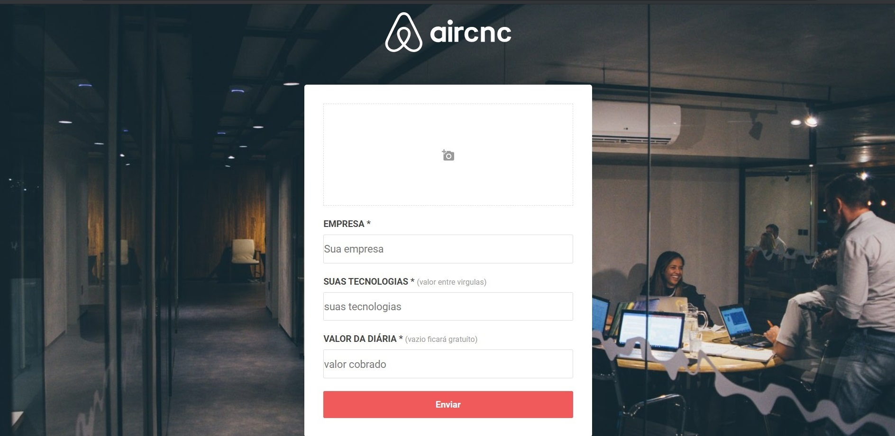

# AirCnC **FRONT-END** - *OminiStack 9.0*

## [VISUALIZAR PARTE BACK-END](https://github.com/honassis/aircnc-backend)
## [VISUALIZAR PARTE MOBILE](https://github.com/honassis/aircnc-mobile)
> contato: honassislopes@gmail.com





## Sobre o sistema:
**AirCnC** foi um sistema feito da semana [**OminiStack 9.0**](https://rocketseat.com.br/starter) , ele foi  basicamente um sistema feito para conectar progamadores com empresas e assim fazer novos contatos, no sistema como cliente é possível selecionar suas tecnologias de interesse, visualizar spots de acordo com seus interesses de tecnologia, como empresa é possível cadastrar spots, aceitar/rejeitar convites

## Sobre o FrontEnd:
site responsivo, foi feito toda a aparência sem depender de nenhum framework de css, ultilizado Axios e Socket.io para se comunicar com o back-end,
## Rotas:
```html
<BrowserRouter>  
    <Switch>
         <Route path="/" exact component={Login}/>
         <Route path="/dashboard" component={Dashboard}/>
          <Route path="/new" component={New}/>
    </Switch>
</BrowserRouter>
   
```
## outras informações: 
* é possível alterar o endereço de comunicação com o  back-end em **src/services/api.js**
> contato: honassislopes@gmail.com